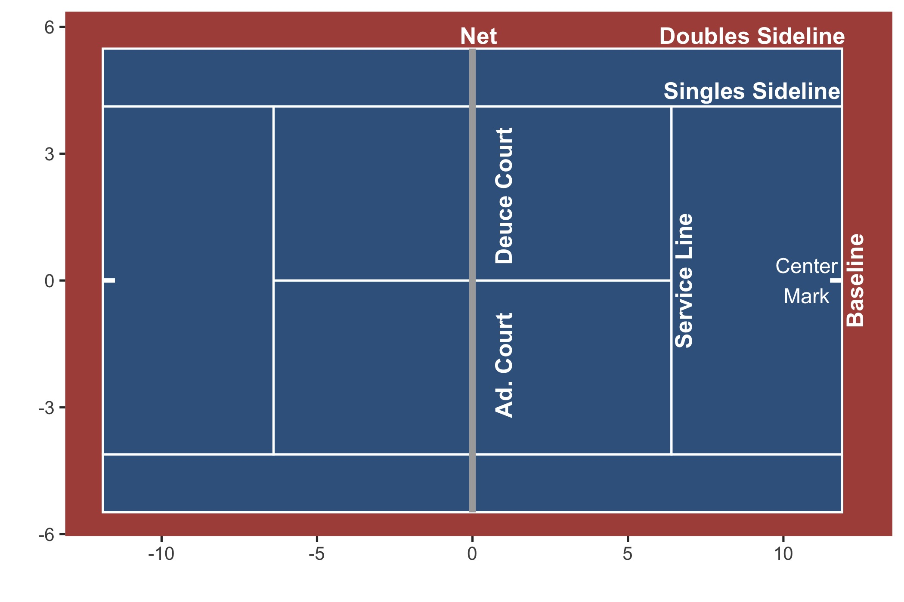

### Read ME

This repo contains tracking data in tennis, scraped from CourtVision. To link data files and reconstruct an entire match, you will need to link files from all of the `ball_trajectory`, `play_by_play`and `misc` directories. Check out the example script `djokovic_example.R`  in the `example` folder for an application.

Currently, there exists over 800 matches available from both ATP and WTA. These matches are from the 2019, 2020, 2021 Roland Garros and 2020, 2021 Australian Open.

If you're interested in seeing how the raw .JSON files were scraped, along with the data processing steps, please feel free to peek at the `notebooks` and `src` directories.

### `ball_trajectory`

Each `.csv` file contains ball trajectory data for each rally. Note: We only have (x,y,z) ball locations when the ball is hit (`hit`), at the highest point of a trajectory (`peak`), as the ball reaches the net (`net`) and when the ball hits the ground (`bounce`).

### `play_by_play`

Each `.csv` file contains rowwise the outcome of each point in an entire tennis match. `Let` points are not available. Some ball trajectory is included as columns (serve impact, serve bounce, serve-return impact, serve-return bounce, etc) 

### `misc`

This repo contains dataframes of player names and their respective player IDs. Note: Players have two IDs (one corresponding to the Australian Open, and the other to Roland Garros). 

Court dimensions are labelled in metres. For convenience, here's a plot.

